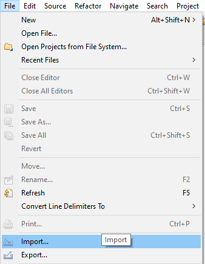
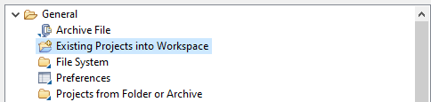
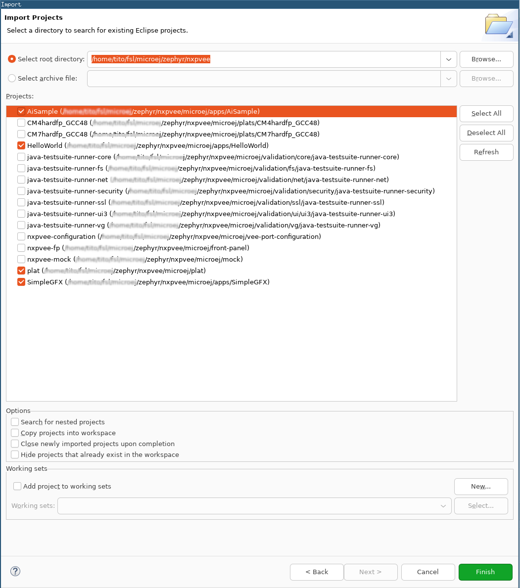
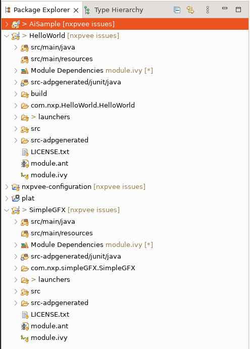
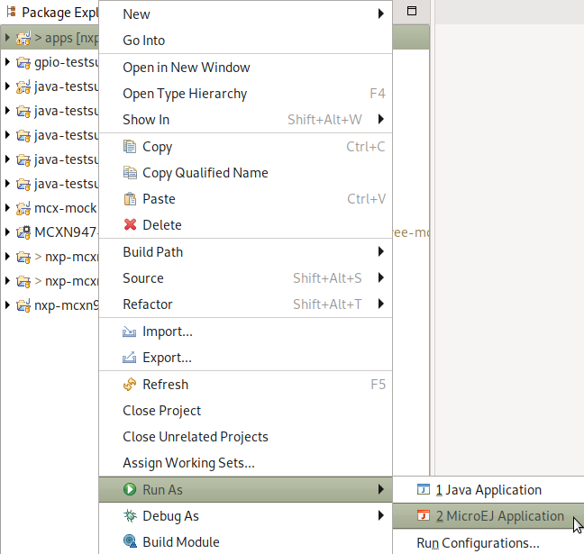
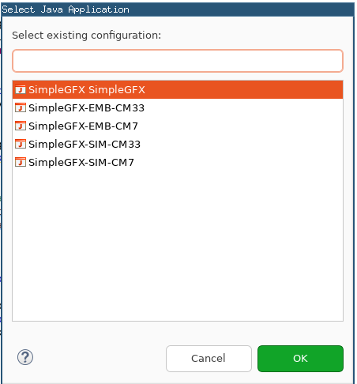
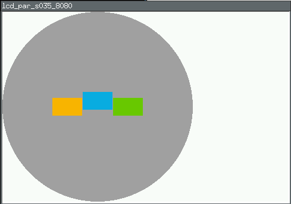
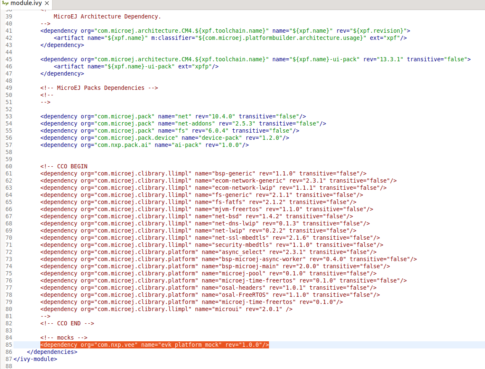
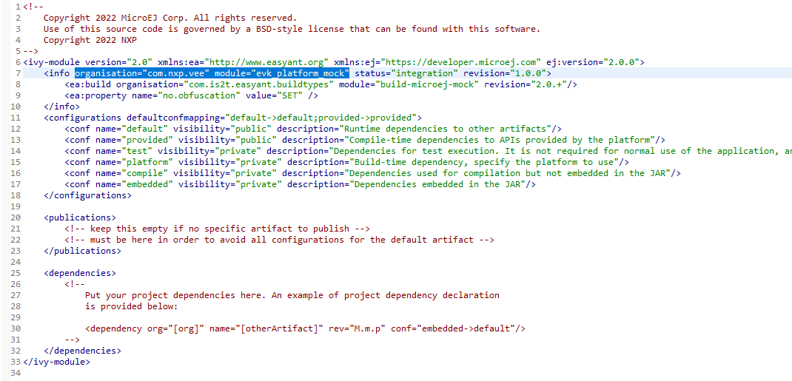

- [NXP Platform Accelerator for Supported NXP board v1.0.0 on Zephyr](#nxp-platform-accelerator-for-supported-nxp-board-v100-on-zephyr)
  - [Supported NXP HW](#supported-nxp-hw)
  - [MicroEJ SDK 6](#microej-sdk-6)
  - [MicroEJ SDK 5](#microej-sdk-5)
  - [Requirements](#requirements)
  - [Directory structure](#directory-structure)
  - [Preliminary steps](#preliminary-steps)
    - [Get the MicroEJ SDK](#get-the-microej-sdk)
    - [Get West](#get-west)
    - [Get GNU ARM Embedded Toolchain](#get-gnu-arm-embedded-toolchain)
    - [Zephyr SDK](#zephyr-sdk)
  - [Fetch the source code](#fetch-the-source-code)
  - [Environment setup](#environment-setup)
    - [Populate a Build Kit](#populate-a-build-kit)
    - [Install Linkserver](#install-linkserver)
    - [Needed Environment variables](#needed-environment-variables)
  - [Trying Platform Accelerator on Zephyr](#trying-platform-accelerator-on-zephyr)
  - [Flashing the target board](#flashing-the-target-board)
- [More options](#more-options)
  - [AI demo project](#ai-demo-project)
  - [SystemView](#systemview)
  - [Compiling Options](#compiling-options)
  - [Running the simulation](#running-the-simulation)
  - [Running validation](#running-validation)
  - [Compile an out-of-tree application](#compile-an-out-of-tree-application)
  - [MicroEJ IDE project setup](#microej-ide-project-setup)
    - [i.MX RT1170 (mimxrt1170_evk/mimxrt1176/cm7)](#imx-rt1170-mimxrt1170_evkmimxrt1176cm7)
    - [Import the project in a new workspace](#import-the-project-in-a-new-workspace)
  - [Build and run applications using the MicroEJ SDK IDE](#build-and-run-applications-using-the-microej-sdk-ide)
    - [Build and run the applications in simulation mode](#build-and-run-the-applications-in-simulation-mode)
  - [Build and run applications on your Supported NXP board](#build-and-run-applications-on-your-supported-nxp-board)
    - [Get an evaluation license](#get-an-evaluation-license)
    - [Build the applications for target](#build-the-applications-for-target)
      - [Output of the build](#output-of-the-build)
  - [Switching to a production license](#switching-to-a-production-license)
  - [Tutorial: Using native C functions from the high level application](#tutorial-using-native-c-functions-from-the-high-level-application)
    - [Declaring and using native functions in the Java world](#declaring-and-using-native-functions-in-the-java-world)
    - [Implementing the native functions in C world](#implementing-the-native-functions-in-c-world)
    - [Implementing a mockup of the native functions for the simulator](#implementing-a-mockup-of-the-native-functions-for-the-simulator)
  - [Get familiar with MicroEJ](#get-familiar-with-microej)
    - [Examples](#examples)
    - [MicroEJ Documentation](#microej-documentation)
  - [Troubleshooting](#troubleshooting)
    - [Setup error](#setup-error)
      - [West update and "Filename too long" issue](#west-update-and-filename-too-long-issue)
    - [License Error when building application](#license-error-when-building-application)
      - [\[M65\] - License check failed](#m65---license-check-failed)


This project is used to build NXP Platform Accelerator for a [Supported NXP board]
# NXP Platform Accelerator for Supported NXP board v1.0.0 on Zephyr

NXP Platform Accelerator is a VEE (Virtual Execution Environment) and provides a hardware abstraction to develop applications in high-level programming languages such as Java.

NXP Platform Accelerator is built upon [MicroEJ technology](https://www.microej.com/product/vee/).

This release includes:

* Supported NXP board simulator to develop VEE applications and test them on a host PC
    * The simulator program has a graphic display of the EVK board and its LCD panel
* The necessary recipes to embed the VEE architecture for GCC
* Various [Foundation Libraries](https://docs.microej.com/en/latest/ApplicationDeveloperGuide/libraries.html) to provide high level libraries to developers
* Notable Foundation Libraries part of this release are:
    * [MicroUI](https://docs.microej.com/en/latest/ApplicationDeveloperGuide/UI/MicroUI/index.html#section-app-microui) to create user interfaces


    * [AI](https://forge.microej.com/ui/native/microej-developer-repository-release/com/nxp/api/ai/1.0.0/): AI / Machine Learning library based on TensorFlowLite


* Sample applications demonstrating NXP Platform Accelerator:

    * SimpleGFX: draw moving NXP coloured boxes using MicroUI


    * AI_Cifarnet_Demo: runs an inference of CifarNet quantized TensorFlow model on sample images 


* [Mock](https://docs.microej.com/en/latest/PlatformDeveloperGuide/mock.html) support with Java stub implementations to mimick C native functions. Thanks to this mock support, the SimpleGFX application can smoothly run on the simulator

## Supported NXP HW

This release comes with the following sample applications:

* UI demo
* AI demo
* HelloWorld demo

This release supports the following boards:
```
| Board                          | Core | HelloWorld | UI demo | AI demo |
| mimxrt1170_evk/mimxrt1176/cm7  | M7   |      X     |    X    |    X    |
| mimxrt1064_evk                 | M7   |      X     |    X    |    X    |
| mimxrt1060_evkb                | M7   |      X     |    X    |    X    |
| frdm_mcxn947/mcxn947/cpu0      | M33  |      X     |    X    |    X    |
| mimxrt595_evk/mimxrt595s/cm33  | M33  |      X     |    X    |    X    |
| imx8mp_evk/mimx8ml8/m7         | M7   |      X     |         |         |
| frdm_k64f                      | M4   |      X     |         |         |
```

---
## MicroEJ SDK 6

NXP Platform Accelerator is built on MicroEJ technology.

MicroEJ SDK 6 is the latest available MicroEJ SDK.
The SDK 6 uses Gradle plugin to compile and package MicroEJ modules.
It allows the user to use his favourite IDE such as Android Studio or IntelliJ IDEA (see [the list of supported IDE](https://docs.microej.com/en/latest/SDK6UserGuide/install.html#install-the-ide)).

SDK 6 is currently limited to the build, test and simulation of **Applications and Add-on Libraries** (see [Scope and Limitations](https://docs.microej.com/en/latest/SDK6UserGuide/limitations.html#sdk-6-limitations) for more information).
If you need other features, such as **developping a VEE Port**, you have to use the SDK 5.

If you are an application developer only and do not need to make changes to the VEE Port, you can use the SDK 6. Please click on the button below to access to the SDK 6 Getting Started on the Supported NXP board.

[](https://docs.microej.com/en/latest/SDK6UserGuide/gettingStartedIMXRT1170.html)

---

## MicroEJ SDK 5

If you want to modify the VEE Port, make changes to low level source code, please use SDK 5 and continue following this README.

## Requirements
* PC with Windows 10 or higher, or Linux (tested on Debian 11)
    * Note for Mac users: this documentation does not cover Mac usage, however it is supported by the MicroEJ tools. If you are interested in Mac support, please [contact MicroEJ](https://www.microej.com/contact/#form_2).
* Internet connection to [MicroEJ Central Repository](https://developer.microej.com/central-repository/)
* MicroEJ SDK Distribution 23.07 or higher, available [here](https://developer.microej.com/microej-sdk-software-development-kit/)

* A supported NXP board

* Optionally: J-Link Debugger to flash the software

## Directory structure
```
.
├── boards
│   ├── frdm_mcxn947_mcxn947_cpu0_ai.conf
│   ├── frdm_mcxn947_mcxn947_cpu0.conf
│   ├── imx8mp_evk_mimx8ml8_m7.conf
│   ├── mimxrt1060_evkb_ai.conf
│   ├── mimxrt1060_evkb.conf
│   ├── mimxrt1064_evk_ai.conf
│   ├── mimxrt1064_evk.conf
│   ├── mimxrt1170_evk_mimxrt1176_cm7_ai.conf
│   ├── mimxrt1170_evk_mimxrt1176_cm7.conf
│   ├── mimxrt595_evk_mimxrt595s_cm33_ai.conf
│   └── mimxrt595_evk_mimxrt595s_cm33.conf
├── bsp
│   ├── CMakeLists.txt
│   ├── microej
│   ├── modules
│   ├── optional
│   ├── src
│   └── zephyr
├── CMakeLists.txt
├── Documentation
│   └── pictures
├── dummy_dc.overlay
├── Kconfig
├── Licenses
│   ├── COPYING-BSD-3
│   ├── LICENSE-2.0.txt
│   └── MICROEJ_SDK_EULA.txt
├── LICENSE.txt
├── microej
│   ├── apps
│   ├── CMakeLists.txt
│   ├── dummy.c
│   ├── front-panel
│   ├── mock
│   ├── plats
│   ├── scripts
│   ├── validation
│   └── vee-port-configuration
├── nvee_version.txt
├── nxpvee.yaml
├── prj_ai.conf
├── prj.conf
├── README.md
├── README.rst
├── SCR-nxpvee-zephyr.txt
└── west.yml
```

## Preliminary steps

### Get the MicroEJ SDK
The MicroEJ SDK is an Eclipse-based IDE used to build the VEE Port and the high-level applications. The SDK can be used to run the Supported NXP board simulator.

The MicroEJ SDK requires Java JDK. JDK version [depends on the MicroEJ SDK version](https://docs.microej.com/en/latest/SDKUserGuide/systemRequirements.html).

* Install the JDK. You can download it on the [Java SE 11](https://www.oracle.com/java/technologies/downloads/#java11) page
* Install MicroEJ SDK 23.07. Please refer to [Download and Install – MicroEJ Documentation](https://docs.microej.com/en/latest/SDKUserGuide/installSDKDistributionLatest.html#) and [Installer Repository](https://repository.microej.com/packages/SDK/23.07/)

This release has been tested with MicroEJ SDK 23.07 and Java JDK 11.


### Get West
[West](https://docs.zephyrproject.org/latest/develop/west/index.html) is Zephyr's meta-tool that supports multiple repository management. Examples are provided later in this documentation on how to use West to fetch the code and dependencies.

Install West by following [Installing west](https://docs.zephyrproject.org/latest/develop/west/install.html) instructions.

### Get GNU ARM Embedded Toolchain
To build an image that runs on target, you need a Cortex-M toolchain.
The [GNU ARM Embedded Toolchain](https://developer.arm.com/downloads/-/gnu-rm) is used to validate this release.

**Toolchain for Linux**: [gcc-arm-none-eabi-10.3-2021.10-x86_64-linux.tar.bz2](https://developer.arm.com/-/media/Files/downloads/gnu-rm/10.3-2021.10/gcc-arm-none-eabi-10.3-2021.10-x86_64-linux.tar.bz2?rev=78196d3461ba4c9089a67b5f33edf82a&hash=D484B37FF37D6FC3597EBE2877FB666A41D5253B)

**Toolchain for Windows**: [gcc-arm-none-eabi-10.3-2021.10-win32.exe](https://developer.arm.com/-/media/Files/downloads/gnu-rm/10.3-2021.10/gcc-arm-none-eabi-10.3-2021.10-win32.exe?rev=29bb46cfa0434fbda93abb33c1d480e6&hash=3C58D05EA5D32EF127B9E4D13B3244D26188713C)

Once installed, the following environment variable must be set to point to the toolchain directory:

Linux:

* Open file `~/.bashrc`.
* Add the following line at the end of the file:

```
export ARMGCC_DIR=/opt/gcc-arm-none-eabi-10.3-2021.10/
```

Windows:

* Open the `Edit the system environment variables` application on Windows.
* Click on the `Environment Variables…` button.
* Click on the `New…` button under the `User variables` section.
* Set `Variable` Name to `ARMGCC_DIR`.
* Set `Variable Value` to the toolchain directory (e.g. `C:\Program Files (x86)\GNU Arm Embedded Toolchain\10 2021.10`).
* Click on the `Ok` button until it closes `Edit the system environment variables` application.


### Zephyr SDK

Please follow the instructions to download and install Zephyr's requirements here: [Zephyr SDK](https://docs.zephyrproject.org/latest/develop/toolchains/zephyr_sdk.html).


## Fetch the source code

Clone the repository with the following command:

```
mkdir zephyr
cd zephyr
west init -m https://github.com/nxp-mcuxpresso/nxpvee-zephyr.git .
west update
```
you will get:

```
nxpvee
```


## Environment setup

You will need to follow the the following steps to setup a working environment:

### Populate a Build Kit
It is necessary to export a Build Kit from the MicroEJ SDK IDE. This Build Kit is used by the build system to build the VEE Port and the high level applications.

The Build Kit is bundled with the SDK and can be exported using the following steps:
```
    Select File > Export > MicroEJ > Module Manager Build Kit,
    Choose an empty Target directory, `i.e. ${HOME}/microej/BuildKit `
    Click on the Finish button.
```

### Install Linkserver
Please follow instructions in [LinkServer for Microcontrollers](https://www.nxp.com/design/design-center/software/development-software/mcuxpresso-software-and-tools-/linkserver-for-microcontrollers:LINKERSERVER)
to install LinkServer.

### Needed Environment variables
In order to compile correctly you will need to export the following variables:

```
export MICROEJ_BUILDKIT_PATH_VAR=${HOME}/microej/BuildKit
export ECLIPSE_HOME_VAR=${HOME}/MicroEJ/MicroEJ-SDK-21.11/rcp/
```

You can also specify a partial repository, when needed (for example if you need libraries that are not yet public):
```
export MODULE_REPOSITORY_SETTINGS_FILE_VAR=${HOME}/microej/microej-partial-repository/ivysettings.xml
```

<ins>Note:</ins>
Use full path names in above environment variables, do not use special character `~` to represent your home directory.
LinkServer version 1.6.133 is depicted on the command line because this version is working fine, it may work with other versions as well but this is not tested.

## Trying Platform Accelerator on Zephyr
In order to try Platform Accelerator on one of NXP supported HW, you first have to
to compile and flash an image.

From root directory:
```
zephyr$ ls -la
nxpvee
.west
```
Depending on the chosen target platform select the appropriate build command:

- i.MX RT1170 (mimxrt1170_evk/mimxrt1176/cm7)

```
west -v  build -b  mimxrt1170_evk/mimxrt1176/cm7 nxpvee/ -- -DSHIELD=rk055hdmipi4ma0
```
- i.MX RT1064 (mimxrt1064_evk)
```
west -v  build -b  mimxrt1064_evk nxpvee/ --  -DSHIELD=rk043fn66hs_ctg
```
- i.MX RT1060 (mimxrt1060_evkb)
```
west -v  build -b  mimxrt1060_evkb nxpvee/ -- -DSHIELD=rk043fn66hs_ctg
```
- MCXN947 (frdm_mcxn947/mcxn947/cpu0)
```
west -v  build  -b frdm_mcxn947/mcxn947/cpu0 nxpvee/ -- -DSHIELD=lcd_par_s035_8080
```
- i.MX RT595 (mimxrt595_evk/mimxrt595s/cm33)
```
west -v  build -b  mimxrt595_evk/mimxrt595s/cm33 nxpvee/ -- -DSHIELD=g1120b0mipi
```
- i.MX 8MP (imx8mp_evk/mimx8ml8/m7)
```
west -v  build -b  imx8mp_evk/mimx8ml8/m7/ddr nxpvee/
```
- FRDM-K64F (frdm_k64f)
```
west -v  build -b  frdm_k64f nxpvee/
```

At the end of this step you will be able to flash the compiled image


## Flashing the target board
Once the project has been built, the following commands can be used to flash the board with the generated binary:

```
# Flash with CMSIS-DAP:
west flash --runner linkserver

# Flash with J-Link:
west flash --runner jlink
```
---
# More options

## AI demo project
This repository contains several demo applications: one is an AI based demo.  
To compile the AI demo project you need to add:
```
-DOVERLAY_CONFIG=prj_ai.conf
```
to the above commands.

For example, to build the AI demo for i.MXRT1170 EVK, the following command can be used:
```
west -v  build -b  mimxrt1170_evk/mimxrt1176/cm7 nxpvee/ -- -DSHIELD=rk055hdmipi4ma0 -DOVERLAY_CONFIG=prj_ai.conf
```

## SystemView
[SystemView](https://www.segger.com/products/development-tools/systemview/) is a tool from Segger. This is a real-time recording and visualization tool for embedded systems.

This VEE Port supports SystemView. To compile with the support for SystemView you need to add:
```
-DOVERLAY_CONFIG=prj_systemview.conf
```

## Compiling Options
Following flag can be added to the west command:
```
-DVERB=1      # increase build verbosity
```


## Running the simulation
To run the simulation, after compiling the demo of choice, you need to issue:
```
west build  -t java-run
```

## Running validation
To run the validation you need to:
```
1. compile for a supported target
west -v  build  -b frdm_mcxn947/mcxn947/cpu0 nxpvee/ -- -DSHIELD=lcd_par_s035_8080

2. go to validation folder
cd nxpvee/microej/validation/

3. run a supported validation
make VALIDATIONS=CORE_VAL
```

## Compile an out-of-tree application
Should you need to compile an application that is not in nxpvee tree
you can do so like

```
west build  -b frdm_mcxn947/mcxn947/cpu0 nxpvee   -- \
    -DSHIELD=lcd_par_s035_8080 -DJUSAGE=prod \
    -DJPATH=PATH_TO_APPLICATION \
    -DJMAIN=APP_MAIN
```

## MicroEJ IDE project setup


Please note that since Platform Accelerator port on Zephyr supports multiple boards
and multiple architectures, you need to compile at least once for the target board you want to use.

As an example:
### i.MX RT1170 (mimxrt1170_evk/mimxrt1176/cm7)
```
west -v  build -b  mimxrt1170_evk/mimxrt1176/cm7 nxpvee/ -- -DSHIELD=rk055hdmipi4ma0
```


### Import the project in a new workspace
Launch MicroEJ SDK and create a blank workspace.

Import the cloned repository as an existing project:






Then select these projects from the repository:




The package explorer view should look like this:




## Build and run applications using the MicroEJ SDK IDE

This release comes with an example VEE application.


Application `SimpleGFX` displays three moving rectangles using the [MicroUI API](https://docs.microej.com/en/latest/ApplicationDeveloperGuide/UI/MicroUI/index.html#section-app-microui). The coordinates of the rectangles are calculated in C native functions.


### Build and run the applications in simulation mode
To run applications in simulation mode, right-click on the apps project and select `Run As -> MicroEJ Application`:




To run the application in simulation mode, select the mode _(SIM)_:





Here is the `SimpleGFX` application running in simulation:




## Build and run applications on your Supported NXP board


### Get an evaluation license
A license is required to build an embedded application. 

A MicroEJ license is required to build high-level applications and the VEE Port for target hardware.

Evaluation licenses can be obtained for free. Please follow [the instructions from MicroEJ](https://docs.microej.com/en/latest/SDKUserGuide/licenses.html#evaluation-license).

With an evaluation license, you can build high-level applications with no limitation in simulation mode. However, applications built with an evaluation license will run for a limited time on target hardware.

Evaluation licenses must be renewed periodically (every month).

**Important note**: applications built with an evaluation license will freeze after a random period of time. A production license is necessary to have a fully working application on the target.


### Build the applications for target
With the MicroEJ SDK IDE, simply run the application the same way than [in simulation](#build-and-run-the-applications-in-simulation-mode) but by choosing the mode _(EMB)_.

#### Output of the build
The build will produce two artifacts:

* *microejapp.o*: the linked managed code application.
* *microejruntime.a*: the VEE core.


These artifacts are copied to the build directory `build/`.


## Switching to a production license
To switch to a production license, please contact your NXP representative.

## Tutorial: Using native C functions from the high level application
Some functions directly used by the high-level application can be implemented in C. It is called the [Native Interface Mechanism](https://docs.microej.com/en/latest/VEEPortingGuide/native.html).

A native method is declared in the Application but is implemented in the native world. So a native declaration requires a C and Java implementation for the Simulator. You can find an example of a native method on [this page](https://docs.microej.com/en/latest/VEEPortingGuide/sni.html?highlight=native#example).

You can have custom natives specific to the Java application (less portable between VEE Ports but fast execution). On the other hand, you can use native methods provided by [Foundation Libraries](https://docs.microej.com/en/latest/glossary.html#term-Foundation-Library) (Portable between VEE Ports but takes more time at the execution). 

The SimpleGFX application uses of C native function to calculate rectangles' coordinates (mainly for demonstration's sake).

### Declaring and using native functions in the Java world
It is recommended to store all your native methods in the same public class. This public class contains methods with the same parameters as the C native functions.

The name of the C function is `Java_<package_name>_<class_name>_<method_name>`. Any underscore (`_`) character in `package_name`, `class_name`, or `function_name` is replaced by `_1`. Dots (`.`) are replaced by underscores `_`.

For these reasons, it is handy to stick to Java naming conventions and use camel case for class and method names and lowercase only package names.

For example:
````
package com.nxp.application;

public class MyClassNatives {
	/* package */ native static int NativeFunction(int a);
};
````

This can be used in the application source code this way:
````
j = MyClassNatives.NativeFunction(i);
````

### Implementing the native functions in C world
The native functions are implemented in C, with a name deriving from the package name and the native class name.
In the previous example, we would have:
````
int Java_com_nxp_application_MyClassNatives_NativeFunction(int a)
{
    int i;

[...]

    return i;
}
````

When you implement a native method, it is recommended to use the type of `sni.h` rather than the native type. This ensures type consistency between Java and C. 
You could use `jint` instead of `int` in the example above.

The `sni.h` file is located on `build/platform/inc/` folder.

### Implementing a mockup of the native functions for the simulator
Mockup functions are used to simulate the behavior of native functions when using the MicroEJ SDK Simulator. Mockups are detailed in the [MicroEJ website](https://docs.microej.com/en/latest/PlatformDeveloperGuide/mock.html).

They are implementated in a different MicroEJ SDK project (`microej/mock`).

The name of the file containing the mockup functions is supposed to be the same as the one where the native functions are declared in the application project (e.g. `SimpleGFXNatives.java`).

The file may look like this:
````
package com.nxp.application;

public class MyClassNatives {
    static int NativeFunction(int a) {
        int i;

        [...]

        return i;
    }
};
````

Please note that this project mockup must be added as a dependency inside the VEE Port's `module.ivy` file. The `module.ivy` file is located in the `microej/vee-port-configuration` folder. You will find inside all the dependencies used by the VEE Port.  



The `org` and `name` fields can be found inside the mockup's `module.ivy` file (respectively `organisation` and `module`):



After any modification to the mockup project, you need to rebuild the mock (right click on the mock project and select `Build Module`) and the platform (see [Build the platform](#build-the-vee-port)).

## Get familiar with MicroEJ

To discover insights about MicroEJ technology, please follow some of the entry points below. In addition, you will find useful links to our documentation and our GitHub. 

### Examples

You can try to run other examples on our VEE Port. Here is an exhaustive list of them so that you can go further in the MicroEJ technology:

* [Understand How to Build a Firmware](https://docs.microej.com/en/latest/Tutorials/tutorialUnderstandMicroEJFirmwareBuild.html): It is a document that describes the components, their dependencies, and the process involved in the build of a Firmware.
* [Get Started With GUI](https://docs.microej.com/en/latest/Tutorials/getStartedWithGUI/index.html): It is a guided tutorial to get the basics concepts of our UI.
* [Github resources](https://github.com/MicroEJ):
    * How to use [foundation libraries](https://github.com/MicroEJ/Example-Standalone-Foundation-Libraries) on the Virtual Device or on board.
    * Various examples of [how-to's](https://github.com/MicroEJ/How-To).
    * Some [Demo projects](https://github.com/orgs/MicroEJ/repositories?q=demo&type=all&language=&sort=).


### MicroEJ Documentation

You can take a look at the MicroEJ development documentation.
Below you can find some important chapters:
* [Application Developer Guide](https://docs.microej.com/en/latest/ApplicationDeveloperGuide/index.html): It covers concepts essential to MicroEJ Applications design.
* [MicroEJ VEE Port Developer Guide](https://docs.microej.com/en/latest/VEEPortingGuide/index.html): It covers the main process and configuration of a MicroEJ VEE.
* [Tutorials](https://docs.microej.com/en/latest/Tutorials/index.html#): There are multiple tutorials to master different subjects about the MicroEJ environment (including UI development, code quality and debug, CI/CD…).

## Troubleshooting

### Setup error

#### West update and "Filename too long" issue

On Windows, fetching the source code may trigger the following fatal error:
```error: unable to create file [...]: Filename too long.```

To avoid this, git configuration needs to be updated to handle long file names:

Start Git Bash as Administrator.

Run following command:
```git config --system core.longpaths true```


### License Error when building application

#### [M65] - License check failed

If you have the following error `[M65] - License check failed [tampered (3)]`, please follow the steps on this [page](https://forum.microej.com/t/license-check-fail-workaround-on-microej-sdk-with-jdk-version-8u351/1182)


